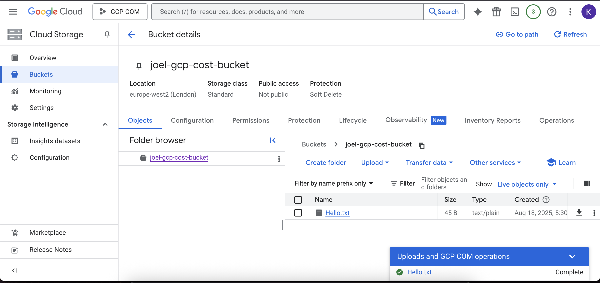

# GCP Cloud Cost Optimisation & Monitoring Project

## 👤 Author
**Joel Joseph**  
Graduate Software & Cloud Engineer | MSc Advanced Computer Science  
[LinkedIn](https://www.linkedin.com/in/joeljosephk) | [Email](mailto:joelkjoseph2023@gmail.com)

---

## 📌 Project Overview
This project demonstrates the deployment and monitoring of a cloud-hosted application on **Google Cloud Platform (GCP)**, with a focus on **cost optimisation, security, and service availability**.  
It aligns with **Google Associate Cloud Engineer** skills and directly supports my application for cloud engineering roles.  

---

## 🚀 Project Objectives
- Deploy a web application on **GCP Compute Engine**  
- Enable secure access using **firewall rules**  
- Configure **Cloud Storage** and **IAM roles** for data security  
- Set up **Cloud Monitoring & Budget Alerts** to manage costs and availability  
- Document the process for learning and portfolio use  

---

## 🛠️ Technologies Used
- **Google Cloud Platform (GCP)**  
  - Compute Engine  
  - VPC & Firewall Rules  
  - IAM (Identity & Access Management)  
  - Cloud Storage (to be added in next step)  
  - Cloud Monitoring (to be added in next step)  
  - Budget Alerts (to be added in next step)  
- **Flask (Python Web Framework)**  
- **Linux (Debian/Ubuntu VM)**  

---

## 📂 Project Setup & Deployment

### 1️⃣ Create a New Project
- Project ID: `gcp-cost-monitoring-project`  
- Billing linked to $300 free credit  

📸 Screenshot:  


---

### 2️⃣ Deploy VM on Compute Engine
- Machine Type: `e2-micro` (free tier eligible)  
- Firewall: Allow HTTP/HTTPS traffic  
- Deployed a Flask app listening on port `8080`  

📸 Screenshot:  


---

### 3️⃣ Configure Firewall Rules
- Created firewall rule: `allow-8080`  
- Opened TCP port `8080` to external traffic  

📸 Screenshot:  


---

### 4️⃣ Run Flask App
Flask App Code (`app.py`):

```python```
from flask import Flask
app = Flask(__name__)

@app.route("/")
def hello():
    return "Hello from GCP VM!"

if __name__ == "__main__":
    app.run(host="0.0.0.0", port=8080)

---

### ▶️ Run Instructions
SSH into the VM and run:

Install Flask (if not already installed)

sudo apt update
sudo apt install -y python3-flask

Start the Flask app using this command
python3 app.py

📸 Screenshot:


---

### 5️⃣ Cloud Storage Integration

- Created a new bucket: `joel-gcp-cost-bucket`
- Location: Regional (`us-central1`)
- Storage class: Standard
- Access control: Uniform
- Uploaded object: `Hello.txt`
- Configured IAM: Granted **Storage Object Viewer** role for controlled access
- Verified access from VM using `gsutil`

#### Commands

```bash```
##### List bucket contents
gsutil ls gs://joel-gcp-cost-bucket

##### Copy file from bucket to VM
gsutil cp gs://joel-gcp-cost-bucket/Hello.txt .

##### Read file contents
cat Hello.txt

📸 Screenshot:


Bucket creation:


IAM:


File added to bucket:



---

### 6️⃣ Monitoring & Budget Alerts

To ensure service availability and cost control, I configured **Cloud Monitoring** (Stackdriver) and Billing Alerts.

---

#### 🟢 Uptime Check
- Created an **Uptime Check** for the VM `demo-vm` (port 8080)
- Checks the Flask app every minute
- Fails if the app is not reachable

📸 Screenshot:  

- 

---

#### 🔔 Alert Policy
- Configured an **Alert Policy** linked to the Uptime Check
- Condition: triggers when 1 consecutive check fails
- Notification Channel: Email (Gmail)

**Steps Taken:**
1. Go to **Monitoring > Alerting > Create Policy**
2. Add Condition → Select **Uptime Check**
3. Add Notification Channel → Email address
4. Name: `Uptime-Alert-Policy`
5. Saved and activated policy

📸 Screenshots:  
-  
-  
---

#### 🧪 Failure Test
- Stopped Flask app on VM:
bash : 
pkill -f app.py
---

#### 💰 Budget Alert
- Configured a Billing Budget of $5 for this project
- Alerts trigger at 50% and 100% usage
- Ensures free credits are not overspent

📸 Screenshot:
-  


